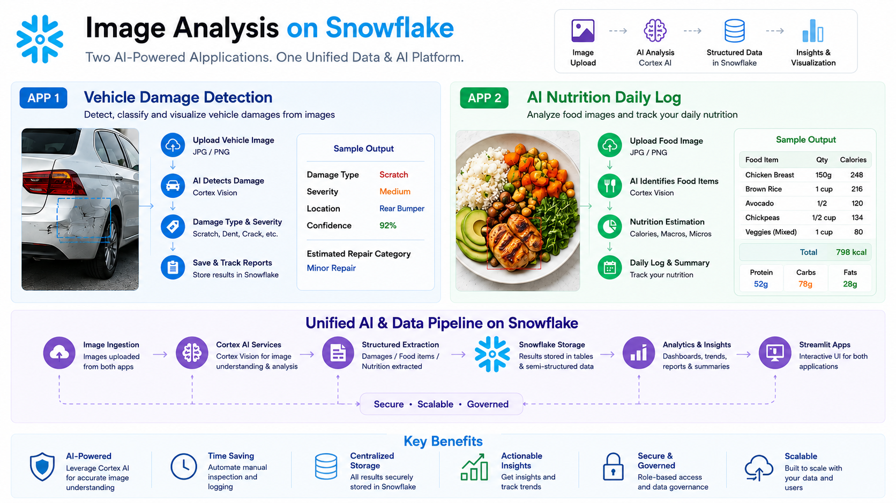

# Food Log and Vehicle Damage Image Analysis using Snowflake Cortex AI

An end-to-end Snowflake Image Analysis project with two Streamlit applications powered by Snowflake Cortex AI.

This project demonstrates how image inputs can be analyzed using AI inside Snowflake to create structured, business-ready outputs. It includes one application for vehicle damage detection from vehicle images and another application for daily nutrition logging from food plate images.




---

## Project Overview

This repository contains two image analysis use cases:

1. **Vehicle Damage Detection App**
   - Upload vehicle images.
   - Detect visible damages from the image.
   - Classify damage type such as scratch, dent, crack, broken part, or paint damage.
   - Estimate severity and damage location.
   - Store damage analysis results in Snowflake.
   - Use the output for insurance inspection, claim review, and repair assessment workflows.

2. **AI Nutrition Daily Log App**
   - Upload food plate images.
   - Detect food items from the image.
   - Estimate nutrition details such as calories, protein, carbs, fats, and other details.
   - Add optional notes for additional context.
   - Maintain a daily food and nutrition log.
   - View daily totals and historical nutrition tracking in the Streamlit app.

---

## Use Case

Image-based workflows are common in real-world business applications.

Manual inspection of images can be slow, inconsistent, and difficult to scale. This project shows how Snowflake Cortex AI and Streamlit can be used to convert images into structured data and actionable insights.

### Vehicle Damage Detection

Insurance and inspection teams often need to review vehicle images to identify:

- Is there visible vehicle damage?
- What type of damage is present?
- Where is the damage located?
- What is the severity?
- What action should be taken next?
- Can the inspection result be stored and tracked?

### AI Nutrition Daily Log

Users who track nutrition often need an easy way to log meals throughout the day.

Instead of manually entering every food item, the app allows users to upload food plate images and generate:

- Food item names
- Estimated quantity
- Calories
- Protein
- Carbs
- Fats
- Meal-level nutrition summary
- Daily nutrition totals

---

## Architecture

```text
Image Upload
      │
      ▼
Streamlit App
      │
      ▼
Snowflake Stage
      │
      ▼
Snowflake Cortex AI Image Analysis
      │
      ▼
Structured AI Output
      │
      ▼
Snowflake Tables
      │
      ├── Vehicle damage results
      ├── Plate nutrition results
      └── Daily nutrition logs
      │
      ▼
Streamlit UI
      │
      ├── View analysis output
      ├── Track results
      ├── Review details
      └── Visualize insights
```

---

## Repository Structure

```text
Food_log_and_Vehical_Damage_Insurance_Image_Analysis_Snowflake/
│
├── 00_setup/
│   ├── .folder
│   ├── 00_infra.sql
│   ├── 01_plate_nutrition_objects.sql
│   └── 02_vehicle_sql_objects.sql
│
├── 01_daily_food_log_dataset/
│   ├── .folder
│   └── 00_daily_nutrition_log.sql
│
├── daily_nutrition_log_app/
│   ├── .streamlit/
│   ├── .folder
│   ├── pyproject.toml
│   ├── snowflake.yml
│   └── streamlit_app.py
│
├── docs/
│
├── plate_nutrition_app/
│
├── vehicle_damage_app/
│   ├── .streamlit/
│   ├── .folder
│   ├── pyproject.toml
│   ├── snowflake.yml
│   └── streamlit_app.py
│
└── README.md
```

---

## Setup

### 1. Create Snowflake Infrastructure

Create the required Snowflake database, schema, warehouse, stage, and supporting objects.

```sql
00_setup/00_infra.sql
```

---

### 2. Create Plate Nutrition Objects

Create Snowflake objects required for food image analysis and nutrition extraction.

```sql
00_setup/01_plate_nutrition_objects.sql
```

These objects support:

- Food image upload
- AI-based food item detection
- Nutrition estimation
- Meal-level structured output
- Daily nutrition tracking

---

### 3. Create Vehicle Damage Objects

Create Snowflake objects required for vehicle damage image analysis.

```sql
00_setup/02_vehicle_sql_objects.sql
```

These objects support:

- Vehicle image upload
- AI-based damage detection
- Damage type classification
- Severity estimation
- Damage report storage

---

### 4. Create Daily Nutrition Log Dataset

Create tables and supporting objects for maintaining daily food and nutrition logs.

```sql
01_daily_food_log_dataset/00_daily_nutrition_log.sql
```

This dataset is used to store and track:

- Logged meals
- Food items
- Nutrition values
- Daily totals
- Historical nutrition entries

---

## Applications

## 1. Vehicle Damage Detection App

The vehicle damage app allows users to upload a vehicle image and get a structured damage analysis result.

### App Folder

```text
vehicle_damage_app/
```

### Run App

```text
vehicle_damage_app/streamlit_app.py
```

### Key Capabilities

- Upload vehicle image
- Detect visible damage
- Identify damage type
- Estimate damage severity
- Identify damage location
- Generate structured damage summary
- Store results in Snowflake
- Review previous damage analysis records

### Sample Questions the App Helps Answer

```text
Is there visible damage on the vehicle?

What type of damage is present?

Is the damage minor, moderate, or severe?

Where is the damage located?

Can this image be used for insurance review?

What repair category may be required?
```

---

## 2. AI Nutrition Daily Log App

The nutrition log app allows users to upload food plate images and maintain a daily nutrition diary.

### App Folder

```text
daily_nutrition_log_app/
```

### Run App

```text
daily_nutrition_log_app/streamlit_app.py
```

### Key Capabilities

- Upload food plate image
- Add optional food notes
- Detect food items
- Estimate calories and macros
- Log meals throughout the day
- Track daily nutrition totals
- View daily protein, carbs, fats, and calorie progress
- Store nutrition log history in Snowflake

### Sample Questions the App Helps Answer

```text
What food items are present in this plate?

How many calories are estimated for this meal?

How much protein have I consumed today?

What are my total carbs and fats for the day?

Which meals did I log today?

How has my nutrition changed across days?
```

---

## Data Stored in Snowflake

The solution stores structured outputs from image analysis inside Snowflake.

### Vehicle Damage Data

- Uploaded image metadata
- Damage type
- Damage severity
- Damage location
- Confidence or AI reasoning
- Inspection timestamp
- Generated damage report

### Nutrition Log Data

- Uploaded food image metadata
- Food items identified
- Estimated quantities
- Calories
- Protein
- Carbs
- Fats
- Meal notes
- Meal timestamp
- Daily nutrition totals

---

## Snowflake Features Used

- Snowflake stages
- Snowflake tables
- Snowflake Cortex AI image understanding
- SQL objects and stored results
- Streamlit in Snowflake
- Structured and semi-structured data storage
- Secure and governed data processing

---

## Why This Project Matters

This project shows how image analysis can be used to build practical AI-powered applications directly on Snowflake.

### Business Benefits

- Faster image-based review
- Reduced manual inspection effort
- Structured output from unstructured images
- Centralized storage in Snowflake
- Interactive Streamlit applications
- Scalable AI-powered workflows
- Reusable pattern for multiple image analysis use cases

---

## Suggested Demo Flow

```text
1. Run the Snowflake setup scripts.
2. Launch the vehicle damage detection Streamlit app.
3. Upload a vehicle damage image.
4. Review AI-generated damage details.
5. Launch the daily nutrition log Streamlit app.
6. Upload a food plate image.
7. Review food items and nutrition estimates.
8. Log multiple meals throughout the day.
9. View daily nutrition totals and history.
```

---

## Example Output: Vehicle Damage Detection

```text
Damage Detected: Yes
Damage Type: Scratch / Dent
Severity: Medium
Location: Rear bumper
Suggested Action: Inspection or minor repair review
```

---

## Example Output: AI Nutrition Daily Log

```text
Meal: Lunch
Food Items: Rice, dal, vegetables, paneer
Estimated Calories: 620 kcal
Protein: 28 g
Carbs: 72 g
Fats: 18 g
Daily Protein So Far: 65 g
```

---

## Key Benefits

- AI-powered image analysis
- Two practical Streamlit applications
- Vehicle damage detection for insurance-style workflows
- Food image analysis for daily nutrition tracking
- Snowflake-backed storage and governance
- Easy-to-demo end-to-end project
- Practical use of multimodal AI with Snowflake

---

## Cleanup

Review and remove Snowflake objects manually when the project is no longer required.

Before cleanup, confirm that the database, schemas, stages, tables, and Streamlit apps are no longer needed.
